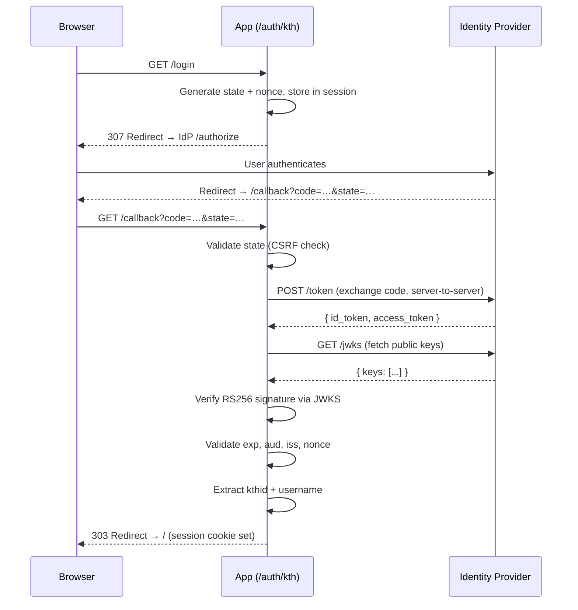

# SSO / OIDC Implementation

## Overview

The app authenticates users via [OpenID Connect](https://openid.net/specs/openid-connect-core-1_0.html) (OIDC) using the **Authorization Code Flow**. In production this targets KTH ADFS; in test environments any standard OIDC provider (e.g. Auth0) works.

Only two fields are ever extracted from the identity provider: **kthid** and **username**. All other personal data (email, name, groups) is discarded at extraction time.

## Login Flow



## File Structure

```
src/student_bot/web/
├── sso_config.py    # SSOConfig dataclass, loaded from env vars
├── kth_oidc.py      # OIDC client logic: discovery, JWKS, token verification, identity extraction
├── sso_routes.py    # FastAPI router: /login, /callback, /logout
└── auth.py          # Session gate: accepts SSO sessions alongside token+Basic Auth
```

## Packages

| Package | Role |
|---------|------|
| [authlib](https://docs.authlib.org/) | OAuth 2.0 client — builds authorization URLs, handles token exchange with `AsyncOAuth2Client` |
| [joserfc](https://pypi.org/project/joserfc/) | JWT signature verification — decodes id_tokens and verifies RS256 signatures against JWKS key sets |
| [httpx](https://www.python-httpx.org/) | Async HTTP client — fetches public OIDC discovery metadata and JWKS endpoints |
| [starlette](https://www.starlette.io/middleware/#sessionmiddleware) | `SessionMiddleware` — signed cookie-based session for storing state, nonce, and user identity |

## Security Mechanisms

**CSRF protection** — A random `state` parameter (`secrets.token_urlsafe`) is generated at login, stored in the session, and validated with `secrets.compare_digest` in the callback. Mismatches reject the request.

**Token replay protection** — A random `nonce` is sent in the authorization request and verified against the nonce claim inside the id_token.

**Cryptographic signature verification** — The id_token's RS256 signature is verified against the provider's JWKS public keys. Forged or tampered tokens are rejected. Missing or empty JWKS data returns `None` (fail-closed).

**Mandatory claim validation** — `exp` and `aud` must be present (per OIDC Core §2). Expired tokens are rejected with 60s clock skew tolerance. Audience must match the configured `client_id`.

**Timing-safe comparisons** — All secret comparisons (state, nonce, passwords) use `secrets.compare_digest` or `hmac.compare_digest`.

## Configuration

Set via environment variables:

```bash
KTH_OIDC_ENABLED=true
KTH_OIDC_ISSUER=https://login.ug.kth.se/adfs    # or Auth0 tenant URL for testing
KTH_OIDC_CLIENT_ID=your-client-id
KTH_OIDC_CLIENT_SECRET=your-client-secret
KTH_OIDC_REDIRECT_URI=http://localhost:8000/auth/kth/callback
KTH_OIDC_SCOPE=openid                             # default
WEB_SESSION_SECRET=random-hex-string               # auto-generated if unset
```

## Integration & Live Provider Testing

To verify the implementation end-to-end prior to receiving production credentials from KTH IT, two testing approaches were used:

1. **Live Cloud Provider (Auth0)** — The application was configured and tested against Auth0 as a live cloud OpenID Connect provider. This validated the complete real-world authentication flow: browser redirection to a cloud login page, real user authentication, back-channel token exchange over HTTPS, dynamic OIDC discovery (`/.well-known/openid-configuration`), public JWKS RSA key retrieval, and RS256 token verification.

2. **Local Mock Provider (`mock_oidc`)** — During initial development, a standalone local mock OIDC server was created to simulate KTH ADFS endpoints (`/oauth2/authorize`, `/oauth2/token`, `/discovery/keys`). The mock server rendered a login form and minted runtime RSA 2048-bit signed `id_token` payloads to test local code paths, CSRF state protection, and session cookie assignment before connecting to live providers.

## Tests

Tests live in `tests/test_kth_oidc.py`. Run with:

```bash
python -m pytest tests/test_kth_oidc.py -v
```

### What's tested

| Test | What it verifies |
|------|-----------------|
| `test_sso_config_from_env` | Config loads from env vars with correct defaults |
| `test_build_authorization_url` | Generated URL contains correct client_id, redirect_uri, state |
| `test_extract_user_identity_privacy_scope` | Only kthid/username extracted; email, name, groups discarded |
| `test_extract_user_identity_fallback_sub` | Falls back to `sub` claim when kthid/username absent |
| `test_extract_user_identity_adfs_xml_schema_and_upn` | Handles KTH ADFS XML schema claim URIs |
| `test_extract_user_identity_base64_encoded_attributes` | Decodes base64-encoded claim values from ADFS |
| `test_parse_jwt_payload_unverified` | Unverified JWT decoding (fallback utility) |
| `test_validate_id_token_claims` | Validates exp, aud, nonce — rejects expired, wrong audience, wrong nonce, **missing exp, missing aud** |
| `test_decode_and_verify_id_token_rs256_signature` | Generates RSA key pair, signs JWT, verifies with JWKS. Rejects forged signatures (different key, same kid). Rejects null/empty JWKS. |
| `test_sso_routes_disabled_by_default` | Returns 400 when SSO disabled |
| `test_sso_login_route_redirect` | Login redirects to IdP authorize endpoint |
| `test_callback_csrf_protection_rejects_missing_or_mismatched_state` | Missing code, missing state, and state mismatch all rejected |
| `test_sso_callback_grants_access_and_session` | Full E2E: login → callback with mocked token exchange → session grants access to protected endpoints |
| `test_exchange_code_for_identity_authlib_client` | Token exchange via Authlib with mocked responses, RS256 verification, identity extraction |

### Testing approach

The signature verification tests generate **real RSA key pairs at runtime** using `joserfc.jwk.RSAKey.generate_key(2048)`, sign JWTs, and verify against the corresponding JWKS. Forged tokens are tested by signing with a *different* private key but using the same `kid` — this confirms the verification rejects the signature, not just the key ID lookup.

Route-level tests use FastAPI's `TestClient` and `monkeypatch` to mock `exchange_code_for_identity`, isolating the HTTP layer from the crypto layer.
